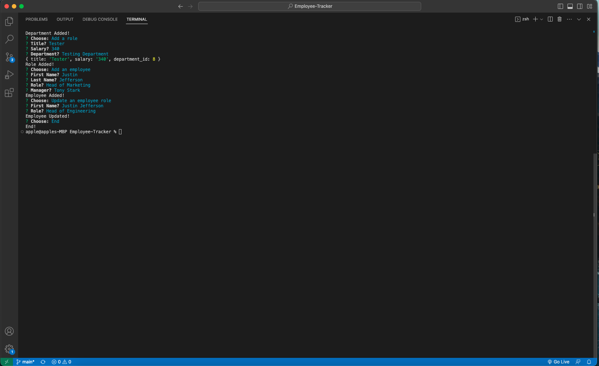

# Employee-Tracker

## Github Repo

https://github.com/timdolan14/Employee-Tracker

## Video Link

https://drive.google.com/file/d/1C6w8slTttZCXF6QOsJGbI0GqGllZyVxz/view

## Description

The Employee Tracker is a comprehensive database management system designed to efficiently track and manage employee information within an organization. Built using SQL (Structured Query Language), this system allows businesses to store, retrieve, and manipulate employee data with ease.

With the Employee Tracker, organizations can maintain a centralized repository of employee information, ensuring that all relevant details are stored in a structured manner. This includes essential information such as employee IDs, names, job titles, departments. By organizing employee data in a structured format, the system enables efficient retrieval and analysis of employee information in one central location.

## Usage
To review this Site Creation, you can review the notes in each section. Open the Chrome DevTools by pressing Command+Option+I (macOS) or Control+Shift+I (Windows). A console panel should open either below or to the side of the webpage in the browser.

## Credits
N/A

## License
N/A